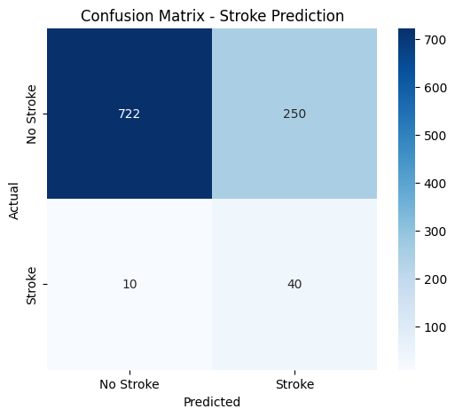
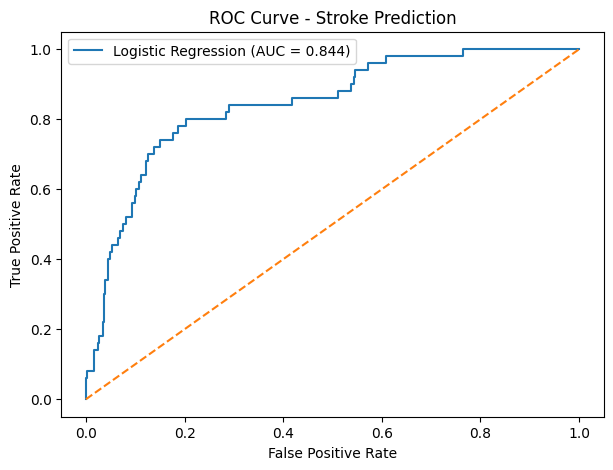

Stroke Prediction Using Logistic Regression

 1. Project Overview

Stroke is a serious medical condition that can cause long-term disability and may be life-threatening. Early identification of people who may be at higher risk of stroke can help support timely medical attention.

This project develops a **Machine Learning model using Logistic Regression** to predict whether a person is likely to have a stroke based on health and demographic information.

The project uses a publicly available healthcare stroke dataset and applies data preprocessing, Logistic Regression, model evaluation, and visualization.

> **Note:** This project is an academic machine-learning study and is not intended to provide medical diagnosis or replace professional medical advice.
> 

 2. Research Problem

The main objective of this project is to develop a binary classification model that predicts the presence or absence of stroke using patient-related information.

  Research Question:

Can Logistic Regression be used to predict stroke occurrence from demographic and health-related features?

  Target Variable:

The target variable is:

stroke = 0 → No Stroke
stroke = 1 → Stroke

 3. Dataset

The project uses the **Healthcare Dataset Stroke Data**.

The dataset contains information about patients, including demographic characteristics and health-related factors.

 Main Features

| Feature | Description |

| gender | Gender of the patient |
| age | Age of the patient |
| hypertension | Whether the patient has hypertension |
| heart_disease | Whether the patient has heart disease |
| ever married | Whether the patient has ever been married |
| work type | Type of occupation |
| Residence type | Urban or Rural residence |
| avg glucose level | Average glucose level |
| bmi | Body Mass Index |
| smoking status | Smoking status |
| stroke | Target variable indicating stroke occurrence |

The dataset contains 5,110 records.

The target distribution is:

No Stroke: 4,861
 Stroke: 249

This shows that the dataset is imbalanced, because the number of non-stroke cases is much larger than the number of stroke cases.

 4. Technologies Used

The project was implemented using Python in Google Colab.

 Libraries

- Python
- Pandas
- NumPy
- Scikit-learn
- Matplotlib
- Seaborn
- Google Colab

   5. Methodology

The project follows these major steps:

 Step 1: Data Loading

The CSV dataset was loaded into a Pandas Data Frame.

''' python
import pandas as pd

df = pd.read_csv("healthcare-dataset-stroke-data.csv")


Step 2: Data Inspection

The dataset was inspected to understand:

* Number of rows and columns
* Feature names
* Data types
* Missing values
* Target class distribution

 Step 3: Data Cleaning

The id column was removed because it does not provide useful information for predicting stroke.

python
df = df.drop(columns=["id"])


The dataset contained missing values in the `bmi` column.

Missing BMI values were handled using **median imputation** during preprocessing.

 Step 4: Feature and Target Separation

The features were separated from the target variable.

```python
X = df.drop(columns=["stroke"])
y = df["stroke"]
```

Here:

* `X` contains the input features.
* `y` contains the stroke prediction target.

 Step 5: Data Preprocessing

Numerical features were processed using:

* Median imputation
* Standardization

Categorical features were processed using:

* Most-frequent value imputation
* One-Hot Encoding

The preprocessing was implemented using Scikit-learn's `ColumnTransformer` and `Pipeline`.

 Step 6: Logistic Regression

A Logistic Regression classifier was selected because stroke prediction is a **binary classification problem**.

The model was configured with:

python
LogisticRegression(
    max_iter=1000,
    class_weight="balanced",
    random_state=42
)


The `class_weight="balanced"` option was used because the dataset contains significantly fewer stroke cases than non-stroke cases.
 Step 7: Model Training

The model was trained using the training dataset:

```python
model.fit(X_train, y_train)
```

 Step 8: Prediction

The trained model was used to predict stroke outcomes for the test dataset.

```python
y_pred = model.predict(X_test)
```

Prediction probabilities were also generated for ROC analysis:

```python
y_prob = model.predict_proba(X_test)[:, 1]
```

---

 6. Model Evaluation

The model was evaluated using:

* Accuracy
* Precision
* Recall
* F1-Score
* ROC-AUC

 Results

| Evaluation Metric |      Score |
| ----------------- | ---------: |
| Accuracy          | **74.56%** |
| Precision         | **13.79%** |
| Recall            | **80.00%** |
| F1-Score          | **23.53%** |
| ROC-AUC           | **84.37%** |

 Interpretation

**Accuracy – 74.56%**

The model correctly classified approximately 74.56% of the test observations.

**Precision – 13.79%**

Among the cases predicted as stroke, 13.79% were actual stroke cases. The relatively low precision is partly related to the class imbalance and the model's effort to identify more stroke cases.

**Recall – 80.00%**

The model correctly identified 80% of the actual stroke cases in the test dataset. Recall is particularly important in this project because missing actual stroke cases can be more concerning than producing additional false-positive predictions.

**F1-Score – 23.53%**

The F1-score represents the balance between precision and recall. The relatively low value reflects the large difference between precision and recall.

**ROC-AUC – 84.37%**

The ROC-AUC score of 0.8437 indicates that the model has a reasonably good ability to distinguish between stroke and non-stroke cases based on its predicted probabilities.


## 7. Confusion Matrix

The confusion matrix obtained from the test data was:

| Actual / Predicted | No Stroke | Stroke |
| ------------------ | --------: | -----: |
| No Stroke          |       722 |    250 |
| Stroke             |        10 |     40 |

 Interpretation

* **722** cases were correctly predicted as No Stroke.
* **250** No Stroke cases were incorrectly predicted as Stroke.
* **10** actual Stroke cases were incorrectly predicted as No Stroke.
* **40** actual Stroke cases were correctly predicted as Stroke.

The confusion matrix demonstrates that the model identified most of the stroke cases in the test set, which is consistent with the recall score of 80%.


 8. ROC Curve

The ROC curve was generated to evaluate the model's ability to distinguish between the two classes at different classification thresholds.

The obtained ROC-AUC score was:

**0.8437**

A higher AUC indicates better discrimination between stroke and non-stroke cases.

The ROC curve visualization is included in the project repository.---

 9. Visualizations

The project contains the following visualizations:

 Confusion Matrix

The confusion matrix shows the number of correct and incorrect predictions for each class.

File:

```text
confusion_matrix.png
```

 ROC Curve

The ROC curve shows the relationship between the true positive rate and false positive rate at different thresholds.

File:

```text
roc_curve.png
```

 10. Project Structure

The GitHub repository can be organized as follows:

text
Stroke-Prediction-Logistic-Regression/
│
├── README.md
├── Stroke_Prediction_Logistic_Regression.ipynb
├── healthcare-dataset-stroke-data.csv
│
└── visualizations/
    ├── confusion_matrix.png
    └── roc_curve.png


 11. How to Run the Project

### Option 1: Google Colab

1. Open the project notebook in Google Colab.
2. Upload the dataset:
   `healthcare-dataset-stroke-data.csv`
3. Run the notebook cells sequentially.
4. The notebook will perform preprocessing, model training, prediction, evaluation, and visualization.

### Option 2: Local Python Environment

Install the required libraries:

```bash
pip install pandas numpy scikit-learn matplotlib seaborn
```

Then open the Jupyter Notebook:

```bash
jupyter notebook
```

Run the notebook cells in order.


## 12. Limitations

The project has several limitations:

* The dataset is highly imbalanced, with significantly fewer stroke cases.
* The model produces a relatively low precision score.
* The dataset contains limited patient information.
* The model should not be considered a medical diagnostic system.
* Performance may change when the model is applied to a different population or dataset.


## 13. Future Improvements

The project can be improved by:

* Testing other classification algorithms such as Random Forest, Decision Tree, or Support Vector Machine.
* Applying advanced techniques for handling class imbalance.
* Performing hyperparameter tuning.
* Using cross-validation.
* Testing the model on additional datasets.
* Performing feature importance analysis.
* Comparing multiple machine-learning models.


## 14. Conclusion

This project successfully implemented a **Logistic Regression model for stroke prediction** using a publicly available healthcare dataset.

The model achieved an accuracy of **74.56%**, recall of **80.00%**, and ROC-AUC of **84.37%**.

The results show that Logistic Regression can identify a substantial proportion of stroke cases in this dataset. However, the relatively low precision and F1-score indicate that there is room for improvement, particularly in reducing false-positive predictions.

Overall, the project demonstrates the application of data preprocessing, machine learning, evaluation metrics, and visualization to a real-world healthcare prediction problem.


## 15. Disclaimer

This project is developed for **educational and academic purposes only**. The predictions produced by the model should not be used for medical diagnosis, treatment, or clinical decision-making. Professional medical advice should always be obtained from qualified healthcare professionals.


## 16. Author

**Stroke Prediction Using Logistic Regression**

Academic Machine Learning Project


text
Stroke_Prediction_Logistic_Regression.ipynb

 Results

### Confusion Matrix



### ROC Curve



